# Mermaid Diagrams for Untrace Contributing Documents

This document contains Mermaid diagrams visualizing the key concepts from all contributing documents.

## Table of Contents

1. [Architecture Diagrams](#architecture-diagrams)
2. [Deliverables Summary Diagrams](#deliverables-summary-diagrams)
3. [Implementation Checklist Diagrams](#implementation-checklist-diagrams)
4. [Observability Guide Diagrams](#observability-guide-diagrams)
5. [PRD Diagrams](#prd-diagrams)
6. [PRFAQ Diagrams](#prfaq-diagrams)
7. [API Schemas Diagrams](#api-schemas-diagrams)

---

## Architecture Diagrams

### High-Level System Architecture

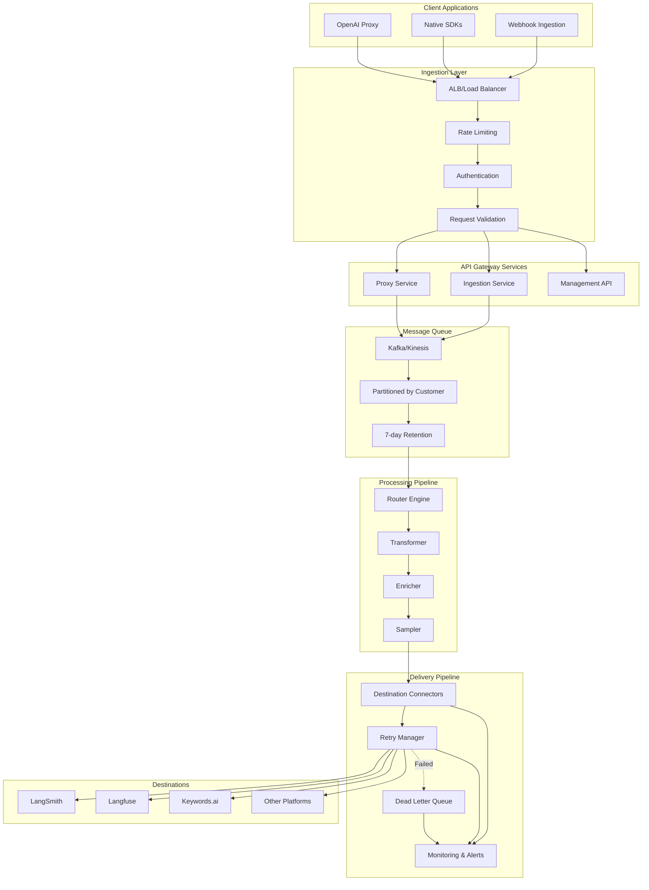
```mermaid
graph TB
    subgraph "Client Applications"
        A1[OpenAI Proxy]
        A2[Native SDKs]
        A3[Webhook Ingestion]
    end

    subgraph "Ingestion Layer"
        B1[ALB/Load Balancer]
        B2[Rate Limiting]
        B3[Authentication]
        B4[Request Validation]
    end

    subgraph "API Gateway Services"
        C1[Proxy Service]
        C2[Ingestion Service]
        C3[Management API]
    end

    subgraph "Message Queue"
        D1[Kafka/Kinesis]
        D2[Partitioned by Customer]
        D3[7-day Retention]
    end

    subgraph "Processing Pipeline"
        E1[Router Engine]
        E2[Transformer]
        E3[Enricher]
        E4[Sampler]
    end

    subgraph "Delivery Pipeline"
        F1[Destination Connectors]
        F2[Retry Manager]
        F3[Dead Letter Queue]
        F4[Monitoring & Alerts]
    end

    subgraph "Destinations"
        G1[LangSmith]
        G2[Langfuse]
        G3[Keywords.ai]
        G4[Other Platforms]
    end

    A1 & A2 & A3 --> B1
    B1 --> B2 --> B3 --> B4
    B4 --> C1 & C2 & C3
    C1 & C2 --> D1
    D1 --> D2 --> D3
    D3 --> E1
    E1 --> E2 --> E3 --> E4
    E4 --> F1
    F1 --> F2
    F2 --> G1 & G2 & G3 & G4
    F2 -.->|Failed| F3
    F1 & F2 & F3 --> F4
```

### Data Flow Architecture

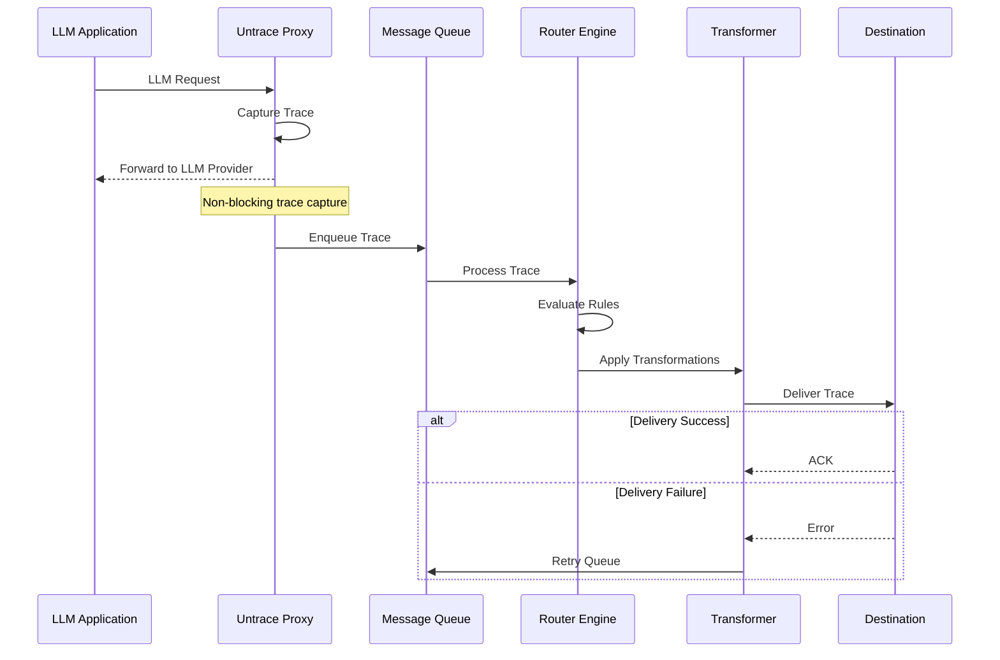
```mermaid
sequenceDiagram
    participant App as LLM Application
    participant Proxy as Untrace Proxy
    participant Queue as Message Queue
    participant Router as Router Engine
    participant Transform as Transformer
    participant Dest as Destination

    App->>Proxy: LLM Request
    Proxy->>Proxy: Capture Trace
    Proxy-->>App: Forward to LLM Provider
    Note over Proxy: Non-blocking trace capture

    Proxy->>Queue: Enqueue Trace
    Queue->>Router: Process Trace
    Router->>Router: Evaluate Rules
    Router->>Transform: Apply Transformations
    Transform->>Dest: Deliver Trace

    alt Delivery Success
        Dest-->>Transform: ACK
    else Delivery Failure
        Dest-->>Transform: Error
        Transform->>Queue: Retry Queue
    end
```

### Multi-Region Deployment Architecture

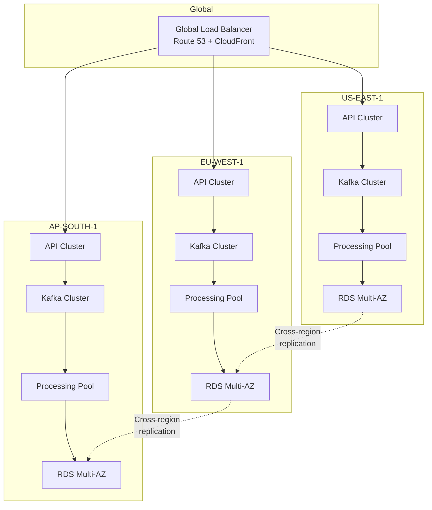
```mermaid
graph TB
    subgraph "Global"
        GLB[Global Load Balancer<br/>Route 53 + CloudFront]
    end

    subgraph "US-EAST-1"
        USE_API[API Cluster]
        USE_KAFKA[Kafka Cluster]
        USE_PROC[Processing Pool]
        USE_RDS[RDS Multi-AZ]
    end

    subgraph "EU-WEST-1"
        EUW_API[API Cluster]
        EUW_KAFKA[Kafka Cluster]
        EUW_PROC[Processing Pool]
        EUW_RDS[RDS Multi-AZ]
    end

    subgraph "AP-SOUTH-1"
        APS_API[API Cluster]
        APS_KAFKA[Kafka Cluster]
        APS_PROC[Processing Pool]
        APS_RDS[RDS Multi-AZ]
    end

    GLB --> USE_API & EUW_API & APS_API

    USE_API --> USE_KAFKA --> USE_PROC
    USE_PROC --> USE_RDS

    EUW_API --> EUW_KAFKA --> EUW_PROC
    EUW_PROC --> EUW_RDS

    APS_API --> APS_KAFKA --> APS_PROC
    APS_PROC --> APS_RDS

    USE_RDS -.->|Cross-region<br/>replication| EUW_RDS
    EUW_RDS -.->|Cross-region<br/>replication| APS_RDS
```

---

## Deliverables Summary Diagrams

### Project Deliverables Overview

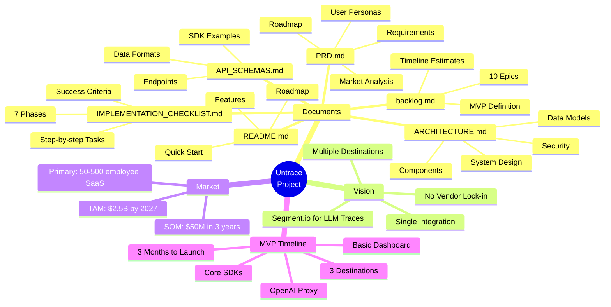
```mermaid
mindmap
  root((Untrace<br/>Project))
    Documents
      backlog.md
        10 Epics
        MVP Definition
        Timeline Estimates
      PRD.md
        Market Analysis
        User Personas
        Requirements
        Roadmap
      ARCHITECTURE.md
        System Design
        Components
        Data Models
        Security
      README.md
        Quick Start
        Features
        Roadmap
      IMPLEMENTATION_CHECKLIST.md
        7 Phases
        Step-by-step Tasks
        Success Criteria
      API_SCHEMAS.md
        Endpoints
        Data Formats
        SDK Examples
    Vision
      Segment.io for LLM Traces
      Single Integration
      Multiple Destinations
      No Vendor Lock-in
    Market
      TAM: $2.5B by 2027
      SOM: $50M in 3 years
      Primary: 50-500 employee SaaS
    MVP Timeline
      3 Months to Launch
      OpenAI Proxy
      3 Destinations
      Basic Dashboard
      Core SDKs
```

### Document Relationships

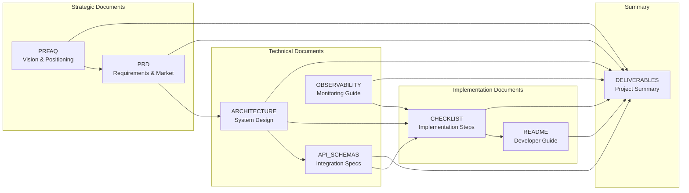
```mermaid
graph LR
    subgraph "Strategic Documents"
        PRFAQ[PRFAQ<br/>Vision & Positioning]
        PRD[PRD<br/>Requirements & Market]
    end

    subgraph "Technical Documents"
        ARCH[ARCHITECTURE<br/>System Design]
        API[API_SCHEMAS<br/>Integration Specs]
        OBS[OBSERVABILITY<br/>Monitoring Guide]
    end

    subgraph "Implementation Documents"
        CHECK[CHECKLIST<br/>Implementation Steps]
        README[README<br/>Developer Guide]
    end

    subgraph "Summary"
        DELIV[DELIVERABLES<br/>Project Summary]
    end

    PRFAQ --> PRD
    PRD --> ARCH
    ARCH --> API
    ARCH --> CHECK
    API --> CHECK
    CHECK --> README
    OBS --> CHECK

    PRFAQ & PRD & ARCH & API & OBS & CHECK & README --> DELIV
```

---

## Implementation Checklist Diagrams

### Implementation Phases Timeline

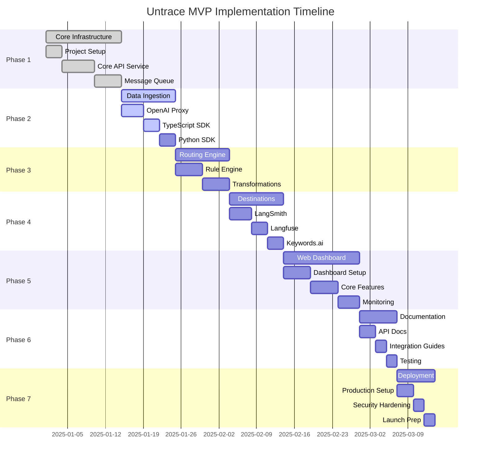
```mermaid
gantt
    title Untrace MVP Implementation Timeline
    dateFormat  YYYY-MM-DD
    section Phase 1
    Core Infrastructure     :done, p1, 2025-01-01, 14d
    Project Setup          :done, p1a, 2025-01-01, 3d
    Core API Service       :done, p1b, after p1a, 6d
    Message Queue          :done, p1c, after p1b, 5d

    section Phase 2
    Data Ingestion         :active, p2, after p1, 10d
    OpenAI Proxy           :active, p2a, after p1, 4d
    TypeScript SDK         :active, p2b, after p2a, 3d
    Python SDK             :p2c, after p2b, 3d

    section Phase 3
    Routing Engine         :p3, after p2, 10d
    Rule Engine            :p3a, after p2, 5d
    Transformations        :p3b, after p3a, 5d

    section Phase 4
    Destinations           :p4, after p3, 10d
    LangSmith              :p4a, after p3, 4d
    Langfuse               :p4b, after p4a, 3d
    Keywords.ai            :p4c, after p4b, 3d

    section Phase 5
    Web Dashboard          :p5, after p4, 14d
    Dashboard Setup        :p5a, after p4, 5d
    Core Features          :p5b, after p5a, 5d
    Monitoring             :p5c, after p5b, 4d

    section Phase 6
    Documentation          :p6, after p5, 7d
    API Docs               :p6a, after p5, 3d
    Integration Guides     :p6b, after p6a, 2d
    Testing                :p6c, after p6b, 2d

    section Phase 7
    Deployment             :p7, after p6, 7d
    Production Setup       :p7a, after p6, 3d
    Security Hardening     :p7b, after p7a, 2d
    Launch Prep            :p7c, after p7b, 2d
```

### Phase Dependencies

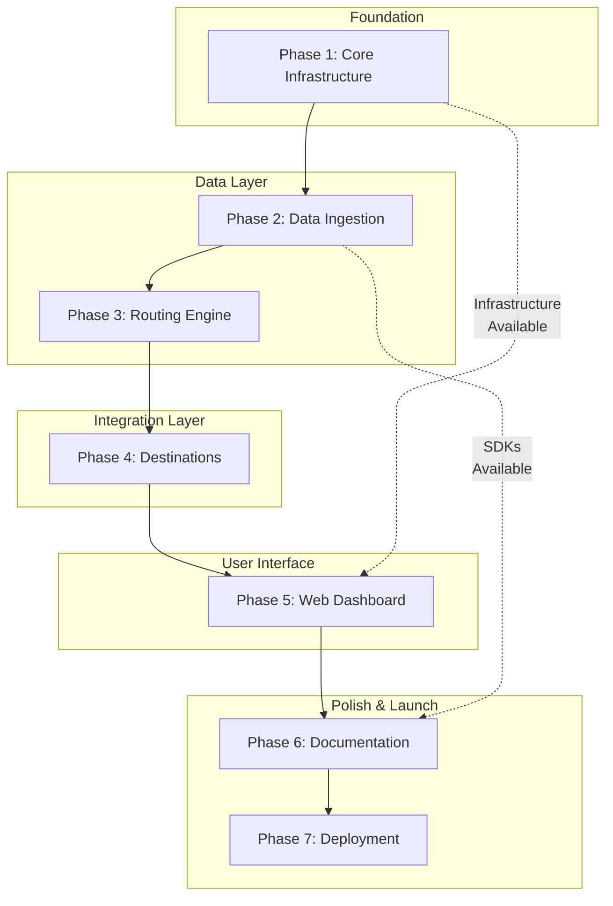
```mermaid
graph TD
    subgraph "Foundation"
        P1[Phase 1: Core Infrastructure]
    end

    subgraph "Data Layer"
        P2[Phase 2: Data Ingestion]
        P3[Phase 3: Routing Engine]
    end

    subgraph "Integration Layer"
        P4[Phase 4: Destinations]
    end

    subgraph "User Interface"
        P5[Phase 5: Web Dashboard]
    end

    subgraph "Polish & Launch"
        P6[Phase 6: Documentation]
        P7[Phase 7: Deployment]
    end

    P1 --> P2
    P2 --> P3
    P3 --> P4
    P4 --> P5
    P5 --> P6
    P6 --> P7

    P1 -.->|Infrastructure<br/>Available| P5
    P2 -.->|SDKs<br/>Available| P6
```

### MVP Success Criteria

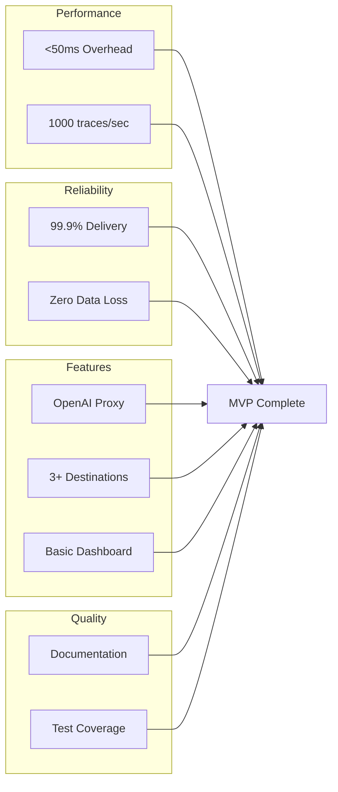
```mermaid
graph LR
    subgraph "Performance"
        PERF1[<50ms Overhead]
        PERF2[1000 traces/sec]
    end

    subgraph "Reliability"
        REL1[99.9% Delivery]
        REL2[Zero Data Loss]
    end

    subgraph "Features"
        FEAT1[OpenAI Proxy]
        FEAT2[3+ Destinations]
        FEAT3[Basic Dashboard]
    end

    subgraph "Quality"
        QUAL1[Documentation]
        QUAL2[Test Coverage]
    end

    PERF1 & PERF2 & REL1 & REL2 & FEAT1 & FEAT2 & FEAT3 & QUAL1 & QUAL2 --> MVP[MVP Complete]
```

---

## Observability Guide Diagrams

### Observability Architecture

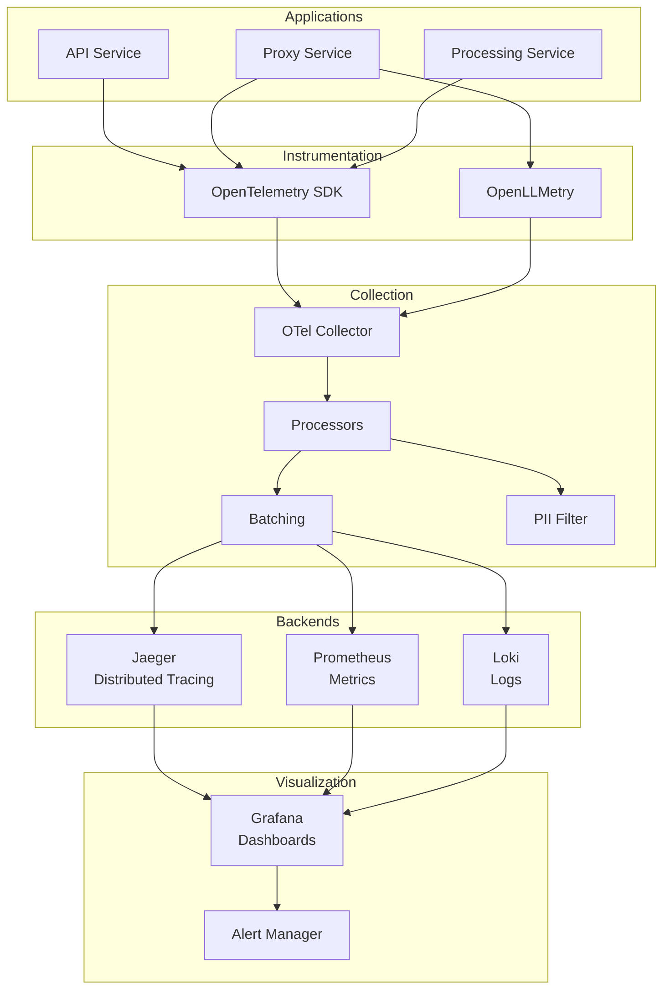
```mermaid
graph TB
    subgraph "Applications"
        APP1[API Service]
        APP2[Proxy Service]
        APP3[Processing Service]
    end

    subgraph "Instrumentation"
        OTEL[OpenTelemetry SDK]
        OLLM[OpenLLMetry]
    end

    subgraph "Collection"
        COLL[OTel Collector]
        PROC[Processors]
        BATCH[Batching]
        FILTER[PII Filter]
    end

    subgraph "Backends"
        JAEGER[Jaeger<br/>Distributed Tracing]
        PROM[Prometheus<br/>Metrics]
        LOKI[Loki<br/>Logs]
    end

    subgraph "Visualization"
        GRAF[Grafana<br/>Dashboards]
        ALERT[Alert Manager]
    end

    APP1 & APP2 & APP3 --> OTEL
    APP2 --> OLLM
    OTEL & OLLM --> COLL
    COLL --> PROC
    PROC --> BATCH & FILTER
    BATCH --> JAEGER & PROM & LOKI
    JAEGER & PROM & LOKI --> GRAF
    GRAF --> ALERT
```

### OpenTelemetry Data Flow

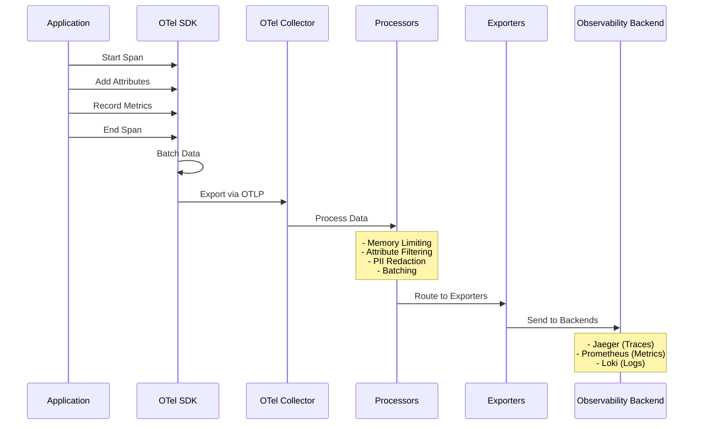
```mermaid
sequenceDiagram
    participant App as Application
    participant SDK as OTel SDK
    participant Coll as OTel Collector
    participant Proc as Processors
    participant Export as Exporters
    participant Backend as Observability Backend

    App->>SDK: Start Span
    App->>SDK: Add Attributes
    App->>SDK: Record Metrics
    App->>SDK: End Span

    SDK->>SDK: Batch Data
    SDK->>Coll: Export via OTLP

    Coll->>Proc: Process Data
    Note over Proc: - Memory Limiting<br/>- Attribute Filtering<br/>- PII Redaction<br/>- Batching

    Proc->>Export: Route to Exporters
    Export->>Backend: Send to Backends

    Note over Backend: - Jaeger (Traces)<br/>- Prometheus (Metrics)<br/>- Loki (Logs)
```

### LLM Instrumentation Layers

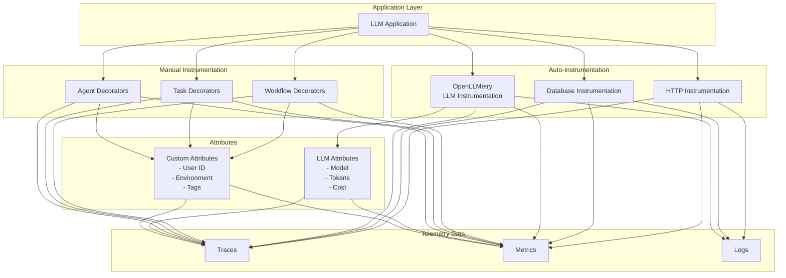
```mermaid
graph TD
    subgraph "Application Layer"
        APP[LLM Application]
    end

    subgraph "Auto-Instrumentation"
        AI_HTTP[HTTP Instrumentation]
        AI_DB[Database Instrumentation]
        AI_LLM[OpenLLMetry<br/>LLM Instrumentation]
    end

    subgraph "Manual Instrumentation"
        MI_WORK[Workflow Decorators]
        MI_TASK[Task Decorators]
        MI_AGENT[Agent Decorators]
    end

    subgraph "Telemetry Data"
        TD_TRACE[Traces]
        TD_METRIC[Metrics]
        TD_LOG[Logs]
    end

    subgraph "Attributes"
        ATTR_LLM[LLM Attributes<br/>- Model<br/>- Tokens<br/>- Cost]
        ATTR_CUSTOM[Custom Attributes<br/>- User ID<br/>- Environment<br/>- Tags]
    end

    APP --> AI_HTTP & AI_DB & AI_LLM
    APP --> MI_WORK & MI_TASK & MI_AGENT

    AI_HTTP & AI_DB & AI_LLM --> TD_TRACE & TD_METRIC & TD_LOG
    MI_WORK & MI_TASK & MI_AGENT --> TD_TRACE & TD_METRIC

    AI_LLM --> ATTR_LLM
    MI_WORK & MI_TASK & MI_AGENT --> ATTR_CUSTOM

    ATTR_LLM & ATTR_CUSTOM --> TD_TRACE & TD_METRIC
```

---

## PRD Diagrams

### User Journey - Onboarding

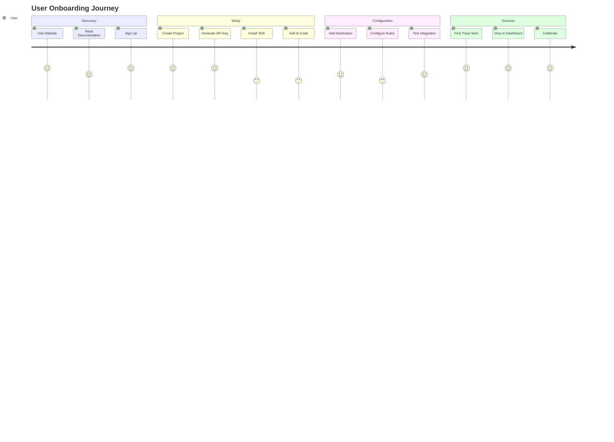
```mermaid
journey
    title User Onboarding Journey
    section Discovery
      Visit Website: 5: User
      Read Documentation: 4: User
      Sign Up: 5: User
    section Setup
      Create Project: 5: User
      Generate API Key: 5: User
      Install SDK: 3: User
      Add to Code: 3: User
    section Configuration
      Add Destination: 4: User
      Configure Rules: 3: User
      Test Integration: 4: User
    section Success
      First Trace Sent: 5: User
      View in Dashboard: 5: User
      Celebrate: 5: User
```

### Market Positioning

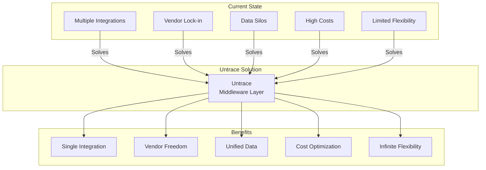
```mermaid
graph TB
    subgraph "Current State"
        CS1[Multiple Integrations]
        CS2[Vendor Lock-in]
        CS3[Data Silos]
        CS4[High Costs]
        CS5[Limited Flexibility]
    end

    subgraph "Untrace Solution"
        SOL[Untrace<br/>Middleware Layer]
    end

    subgraph "Benefits"
        B1[Single Integration]
        B2[Vendor Freedom]
        B3[Unified Data]
        B4[Cost Optimization]
        B5[Infinite Flexibility]
    end

    CS1 -->|Solves| SOL
    CS2 -->|Solves| SOL
    CS3 -->|Solves| SOL
    CS4 -->|Solves| SOL
    CS5 -->|Solves| SOL

    SOL --> B1
    SOL --> B2
    SOL --> B3
    SOL --> B4
    SOL --> B5
```

### Product Feature Hierarchy

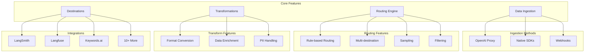
```mermaid
graph TD
    subgraph "Core Features"
        CF1[Data Ingestion]
        CF2[Routing Engine]
        CF3[Transformations]
        CF4[Destinations]
    end

    subgraph "Ingestion Methods"
        IM1[OpenAI Proxy]
        IM2[Native SDKs]
        IM3[Webhooks]
    end

    subgraph "Routing Features"
        RF1[Rule-based Routing]
        RF2[Multi-destination]
        RF3[Sampling]
        RF4[Filtering]
    end

    subgraph "Transform Features"
        TF1[Format Conversion]
        TF2[Data Enrichment]
        TF3[PII Handling]
    end

    subgraph "Integrations"
        INT1[LangSmith]
        INT2[Langfuse]
        INT3[Keywords.ai]
        INT4[10+ More]
    end

    CF1 --> IM1 & IM2 & IM3
    CF2 --> RF1 & RF2 & RF3 & RF4
    CF3 --> TF1 & TF2 & TF3
    CF4 --> INT1 & INT2 & INT3 & INT4
```

### Go-to-Market Strategy

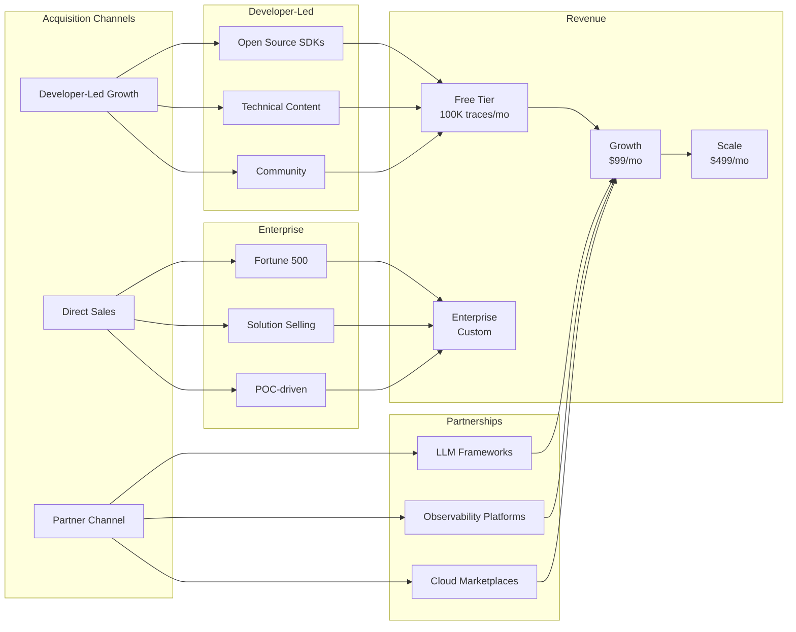
```mermaid
graph LR
    subgraph "Acquisition Channels"
        AC1[Developer-Led Growth]
        AC2[Partner Channel]
        AC3[Direct Sales]
    end

    subgraph "Developer-Led"
        DL1[Open Source SDKs]
        DL2[Technical Content]
        DL3[Community]
    end

    subgraph "Partnerships"
        P1[LLM Frameworks]
        P2[Observability Platforms]
        P3[Cloud Marketplaces]
    end

    subgraph "Enterprise"
        E1[Fortune 500]
        E2[Solution Selling]
        E3[POC-driven]
    end

    subgraph "Revenue"
        R1[Free Tier<br/>100K traces/mo]
        R2[Growth<br/>$99/mo]
        R3[Scale<br/>$499/mo]
        R4[Enterprise<br/>Custom]
    end

    AC1 --> DL1 & DL2 & DL3
    AC2 --> P1 & P2 & P3
    AC3 --> E1 & E2 & E3

    DL1 & DL2 & DL3 --> R1 --> R2
    P1 & P2 & P3 --> R2 --> R3
    E1 & E2 & E3 --> R4
```

---

## PRFAQ Diagrams

### Customer Value Proposition

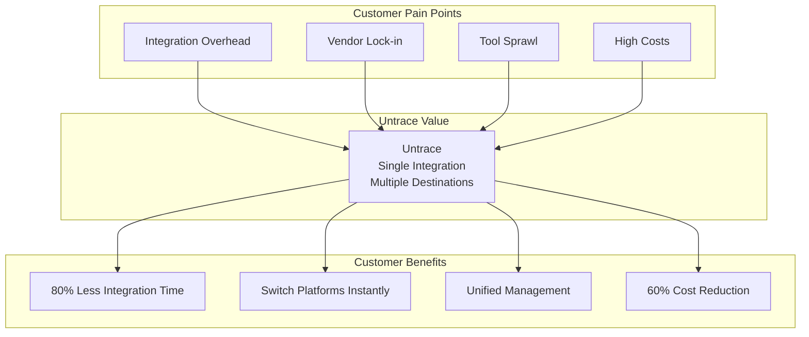
```mermaid
graph TD
    subgraph "Customer Pain Points"
        PP1[Integration Overhead]
        PP2[Vendor Lock-in]
        PP3[Tool Sprawl]
        PP4[High Costs]
    end

    subgraph "Untrace Value"
        UV[Untrace<br/>Single Integration<br/>Multiple Destinations]
    end

    subgraph "Customer Benefits"
        CB1[80% Less Integration Time]
        CB2[Switch Platforms Instantly]
        CB3[Unified Management]
        CB4[60% Cost Reduction]
    end

    PP1 --> UV --> CB1
    PP2 --> UV --> CB2
    PP3 --> UV --> CB3
    PP4 --> UV --> CB4
```

### Competitive Landscape

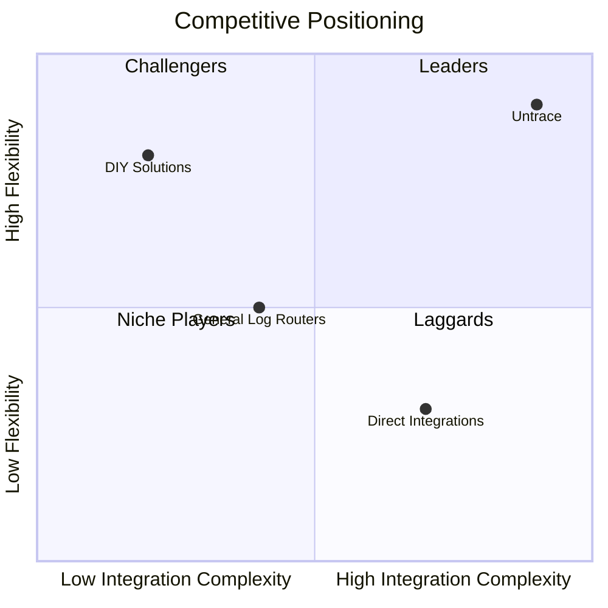
```mermaid
quadrantChart
    title Competitive Positioning
    x-axis Low Integration Complexity --> High Integration Complexity
    y-axis Low Flexibility --> High Flexibility
    quadrant-1 Leaders
    quadrant-2 Challengers
    quadrant-3 Niche Players
    quadrant-4 Laggards
    Untrace: [0.9, 0.9]
    DIY Solutions: [0.2, 0.8]
    Direct Integrations: [0.7, 0.3]
    General Log Routers: [0.4, 0.5]
```

### Customer Acquisition Funnel

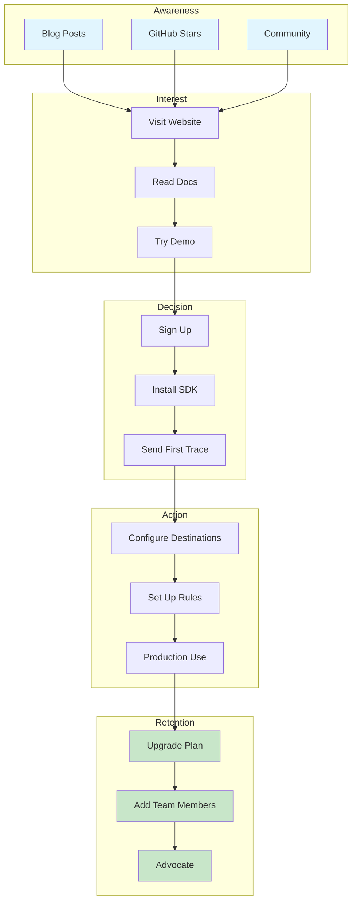
```mermaid
graph TD
    subgraph "Awareness"
        A1[Blog Posts]
        A2[GitHub Stars]
        A3[Community]
    end

    subgraph "Interest"
        I1[Visit Website]
        I2[Read Docs]
        I3[Try Demo]
    end

    subgraph "Decision"
        D1[Sign Up]
        D2[Install SDK]
        D3[Send First Trace]
    end

    subgraph "Action"
        AC1[Configure Destinations]
        AC2[Set Up Rules]
        AC3[Production Use]
    end

    subgraph "Retention"
        R1[Upgrade Plan]
        R2[Add Team Members]
        R3[Advocate]
    end

    A1 & A2 & A3 --> I1
    I1 --> I2 --> I3
    I3 --> D1 --> D2 --> D3
    D3 --> AC1 --> AC2 --> AC3
    AC3 --> R1 --> R2 --> R3

    style A1 fill:#e1f5fe
    style A2 fill:#e1f5fe
    style A3 fill:#e1f5fe
    style R1 fill:#c8e6c9
    style R2 fill:#c8e6c9
    style R3 fill:#c8e6c9
```

---

## API Schemas Diagrams

### API Endpoint Hierarchy

```mermaid
graph TD
    subgraph "API v1"
        ROOT[/v1]
    end

    subgraph "Core Endpoints"
        TRACES[/traces]
        TRACE_SINGLE[POST /traces]
        TRACE_BATCH[POST /traces/batch]
    end

    subgraph "Configuration"
        ROUTING[/routing]
        RULES[/routing/rules]
        RULES_GET[GET /routing/rules]
        RULES_POST[POST /routing/rules]

        DEST[/destinations]
        DEST_GET[GET /destinations]
        DEST_POST[POST /destinations]
    end

    subgraph "Proxy"
        PROXY[/proxy]
        PROXY_OPENAI[/proxy/openai/*]
    end

    subgraph "Monitoring"
        HEALTH[GET /health]
        METRICS[GET /metrics]
    end

    ROOT --> TRACES & ROUTING & DEST & PROXY
    TRACES --> TRACE_SINGLE & TRACE_BATCH
    ROUTING --> RULES
    RULES --> RULES_GET & RULES_POST
    DEST --> DEST_GET & DEST_POST
    PROXY --> PROXY_OPENAI
    ROOT --> HEALTH & METRICS
```

### Data Flow Through API

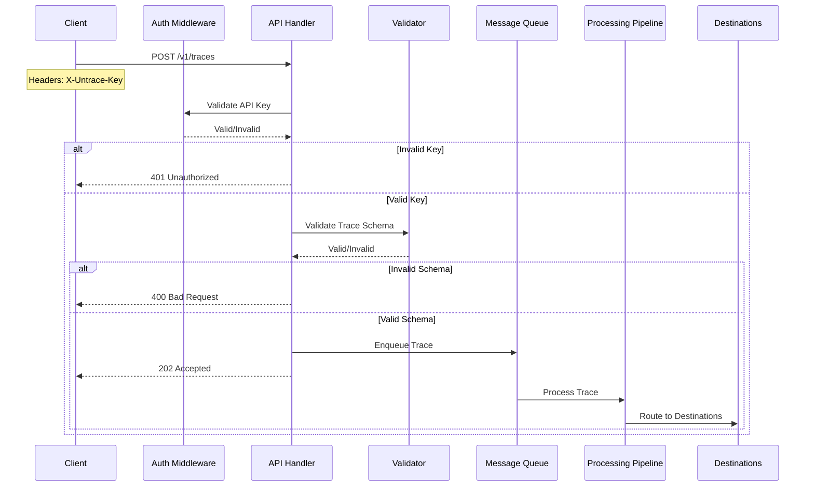
```mermaid
sequenceDiagram
    participant Client
    participant Auth as Auth Middleware
    participant API as API Handler
    participant Valid as Validator
    participant Queue as Message Queue
    participant Process as Processing Pipeline
    participant Dest as Destinations

    Client->>API: POST /v1/traces
    Note over Client: Headers: X-Untrace-Key

    API->>Auth: Validate API Key
    Auth-->>API: Valid/Invalid

    alt Invalid Key
        API-->>Client: 401 Unauthorized
    else Valid Key
        API->>Valid: Validate Trace Schema
        Valid-->>API: Valid/Invalid

        alt Invalid Schema
            API-->>Client: 400 Bad Request
        else Valid Schema
            API->>Queue: Enqueue Trace
            API-->>Client: 202 Accepted

            Queue->>Process: Process Trace
            Process->>Dest: Route to Destinations
        end
    end
```

### SDK Integration Patterns

```mermaid
graph TB
    subgraph "TypeScript/JavaScript"
        TS_MANUAL[Manual Tracing]
        TS_AUTO[OpenAI Wrapper]
        TS_DECORATOR[Decorators]
    end

    subgraph "Python"
        PY_MANUAL[Manual Tracing]
        PY_AUTO[OpenAI Wrapper]
        PY_CONTEXT[Context Manager]
    end

    subgraph "Integration Methods"
        IM_PROXY[Proxy URL Change]
        IM_SDK[SDK Installation]
        IM_WEBHOOK[Webhook POST]
    end

    subgraph "Untrace API"
        API[Untrace API]
    end

    TS_MANUAL & TS_AUTO & TS_DECORATOR --> IM_SDK
    PY_MANUAL & PY_AUTO & PY_CONTEXT --> IM_SDK

    IM_PROXY --> API
    IM_SDK --> API
    IM_WEBHOOK --> API

    style TS_AUTO fill:#c8e6c9
    style PY_AUTO fill:#c8e6c9
    style IM_PROXY fill:#fff9c4
```

### Destination Format Transformation

```mermaid
graph LR
    subgraph "Input Format"
        IF[Untrace<br/>Trace Format]
    end

    subgraph "Transformation Engine"
        TE1[Format Detector]
        TE2[Field Mapper]
        TE3[Value Converter]
        TE4[Validator]
    end

    subgraph "Output Formats"
        OF1[LangSmith Format]
        OF2[Langfuse Format]
        OF3[Keywords.ai Format]
        OF4[Custom Webhook]
    end

    IF --> TE1
    TE1 --> TE2
    TE2 --> TE3
    TE3 --> TE4

    TE4 --> OF1
    TE4 --> OF2
    TE4 --> OF3
    TE4 --> OF4

    Note1[Run Format] -.-> OF1
    Note2[Trace Format] -.-> OF2
    Note3[Request Format] -.-> OF3
    Note4[Configurable] -.-> OF4
```

---

## Customer Use Cases & Personas

### Customer Journey & Use Cases

```mermaid
graph TB
    subgraph "Customer Personas"
        P1[Product Manager<br/>📊 Data Validation]
        P2[Developer<br/>🐛 Production Debugging]
        P3[Data Scientist<br/>🤖 Model Fine-tuning]
        P4[DevOps Engineer<br/>⚡ System Monitoring]
    end

    subgraph "LLM Application"
        APP[Production LLM App<br/>ChatGPT, Claude, etc.]
    end

    subgraph "Untrace Platform"
        SDK[Untrace SDK<br/>Auto-instrumentation]
        API[Untrace API<br/>Trace Ingestion]
        PROCESS[Processing Pipeline<br/>Route & Transform]
    end

    subgraph "Use Case Destinations"
        subgraph "Product Validation"
            DASH[Untrace Dashboard<br/>📈 Performance Metrics<br/>💰 Cost Analysis<br/>🎯 Quality Scores]
        end

        subgraph "Developer Debugging"
            LOGS[Logging Platform<br/>📝 Structured Logs<br/>🔍 Error Tracking<br/>📊 Request/Response]
        end

        subgraph "Data Science"
            DS_PLATFORM[ML Platform<br/>📊 Training Data<br/>🔄 Fine-tuning<br/>📈 Model Performance]
        end

        subgraph "System Monitoring"
            MONITOR[Observability<br/>📊 Metrics<br/>🔍 Distributed Tracing<br/>🚨 Alerting]
        end
    end

    APP --> SDK
    SDK --> API
    API --> PROCESS

    PROCESS --> DASH
    PROCESS --> LOGS
    PROCESS --> DS_PLATFORM
    PROCESS --> MONITOR

    P1 -.->|"Monitor production<br/>quality & costs"| DASH
    P2 -.->|"Debug errors &<br/>performance issues"| LOGS
    P3 -.->|"Extract training data<br/>for model improvement"| DS_PLATFORM
    P4 -.->|"Monitor system health<br/>& performance"| MONITOR
```

### Product Manager Use Case: Data Validation

```mermaid
journey
    title Product Manager: Production Data Validation
    section Monitor Quality
      Deploy LLM Feature: 3: PM
      Check Performance Metrics: 5: PM
      Review Cost Analysis: 4: PM
      Validate Response Quality: 5: PM
    section Optimize
      Identify Slow Models: 4: PM
      Adjust Sampling Rates: 5: PM
      Set Quality Thresholds: 5: PM
      Monitor Improvements: 5: PM
```

### Developer Use Case: Production Debugging

```mermaid
sequenceDiagram
    participant User as End User
    participant App as LLM Application
    participant SDK as Untrace SDK
    participant API as Untrace API
    participant Logs as Logging Platform
    participant Dev as Developer

    User->>App: Submit Request
    App->>SDK: LLM API Call
    SDK->>API: Send Trace Data
    API->>Logs: Store Structured Logs

    Note over App: Error Occurs
    App->>SDK: Error Response
    SDK->>API: Error Trace
    API->>Logs: Error Logs

    Dev->>Logs: Check Error Logs
    Logs-->>Dev: Error Details + Context
    Dev->>Dev: Debug & Fix Issue
    Dev->>App: Deploy Fix
```

### Data Scientist Use Case: Model Fine-tuning

```mermaid
graph LR
    subgraph "Data Collection"
        PROD[Production LLM Calls]
        TRACES[Untrace Traces]
        FILTER[Data Filtering<br/>Quality Scores<br/>Error Patterns]
    end

    subgraph "Training Pipeline"
        EXTRACT[Extract Training Data<br/>Input/Output Pairs<br/>Context & Metadata]
        PREP[Data Preparation<br/>Format Conversion<br/>Quality Validation]
        TRAIN[Model Training<br/>Fine-tuning<br/>Performance Metrics]
    end

    subgraph "Model Deployment"
        DEPLOY[Deploy Improved Model]
        MONITOR[Monitor Performance]
        ITERATE[Iterate & Improve]
    end

    PROD --> TRACES
    TRACES --> FILTER
    FILTER --> EXTRACT
    EXTRACT --> PREP
    PREP --> TRAIN
    TRAIN --> DEPLOY
    DEPLOY --> MONITOR
    MONITOR --> ITERATE
    ITERATE --> PROD
```

### DevOps Engineer Use Case: System Monitoring

```mermaid
graph TB
    subgraph "Monitoring Stack"
        METRICS[System Metrics<br/>CPU, Memory, Latency]
        TRACES[Distributed Traces<br/>Request Flow<br/>Dependencies]
        LOGS[Application Logs<br/>Errors, Warnings<br/>Debug Info]
    end

    subgraph "Alerting & Response"
        ALERTS[Alert Manager<br/>Threshold Breaches<br/>Anomaly Detection]
        DASHBOARD[Monitoring Dashboard<br/>Real-time Status<br/>Historical Trends]
        RUNBOOKS[Incident Response<br/>Automated Recovery<br/>Escalation Procedures]
    end

    subgraph "Untrace Integration"
        UNTRACE[Untrace Platform<br/>LLM-specific Metrics<br/>Provider Performance]
    end

    UNTRACE --> METRICS
    UNTRACE --> TRACES
    UNTRACE --> LOGS

    METRICS --> ALERTS
    TRACES --> ALERTS
    LOGS --> ALERTS

    ALERTS --> DASHBOARD
    ALERTS --> RUNBOOKS

    DASHBOARD --> RUNBOOKS
```

### Multi-Persona Collaboration Flow

```mermaid
graph TB
    subgraph "Production LLM System"
        APP[LLM Application<br/>ChatGPT, Claude, etc.]
    end

    subgraph "Untrace Platform"
        SDK[Untrace SDK<br/>Zero-latency capture]
        API[Untrace API<br/>Trace ingestion]
        ROUTER[Intelligent Router<br/>Multi-destination]
    end

    subgraph "Product Team"
        PM[Product Manager<br/>📊 Business Metrics]
        ENG[Engineering Team<br/>🐛 Technical Issues]
        DS[Data Science Team<br/>🤖 Model Improvement]
        OPS[DevOps Team<br/>⚡ System Health]
    end

    subgraph "Destinations"
        DASH[Untrace Dashboard<br/>Business Intelligence]
        LOGS[Logging Platform<br/>Technical Debugging]
        ML[ML Platform<br/>Model Training]
        OBS[Observability<br/>System Monitoring]
    end

    APP --> SDK
    SDK --> API
    API --> ROUTER

    ROUTER --> DASH
    ROUTER --> LOGS
    ROUTER --> ML
    ROUTER --> OBS

    PM -.->|"Monitor quality<br/>& costs"| DASH
    ENG -.->|"Debug issues<br/>& performance"| LOGS
    DS -.->|"Extract training data<br/>& insights"| ML
    OPS -.->|"Monitor health<br/>& alerts"| OBS

    DASH -.->|"Quality issues<br/>Cost anomalies"| PM
    LOGS -.->|"Error patterns<br/>Performance issues"| ENG
    ML -.->|"Model insights<br/>Training opportunities"| DS
    OBS -.->|"System alerts<br/>Capacity issues"| OPS
```

---

## Summary

These Mermaid diagrams provide visual representations of:

1. **Architecture**: System components, data flow, and deployment strategies
2. **Deliverables**: Project structure and document relationships
3. **Implementation**: Timeline, dependencies, and success criteria
4. **Observability**: Monitoring architecture and instrumentation patterns
5. **PRD**: User journeys, market positioning, and go-to-market strategy
6. **PRFAQ**: Value propositions, competitive landscape, and acquisition funnel
7. **API Schemas**: Endpoint structure, data flow, and integration patterns

Each diagram is designed to complement the written documentation and provide quick visual understanding of complex concepts.