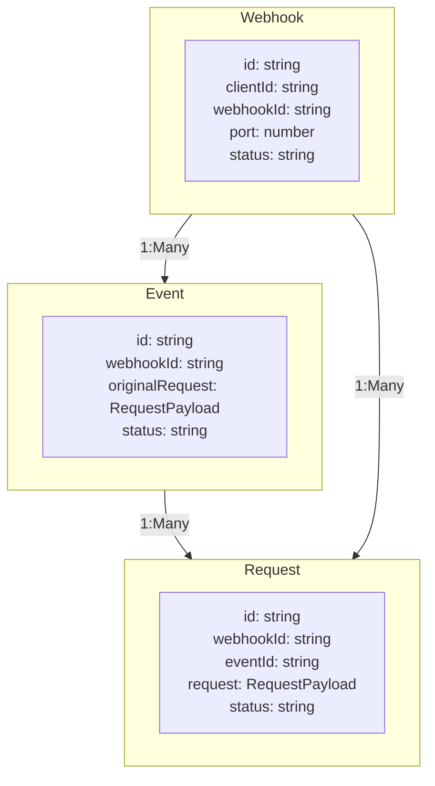

# Data Model

This document explains the core data entities in Untrace and how they relate to each other.

## Entity Relationships



## Core Entities

### Webhook Entity

The primary entity that manages webhook routing and configuration.

<ParamField body="id" type="string" required>
  Unique identifier with 't' prefix
</ParamField>

<ParamField body="clientId" type="string" required>
  Client identifier for routing
</ParamField>

<ParamField body="webhookId" type="string" required>
  Associated webhook ID
</ParamField>

<ParamField body="port" type="number" required>
  Local port to deliver requests to
</ParamField>

<ParamField body="status" type="string" required>
  Current webhook status. Can be 'active' or 'inactive'
</ParamField>

<ParamField body="localConnectionStatus" type="string" required>
  Connection status. Can be 'connected' or 'disconnected'
</ParamField>

<ParamField body="config" type="object" required>
  Webhook configuration object
  ```typescript
  {
    storage: {
      storeHeaders: boolean;
      storeRequestBody: boolean;
      storeResponseBody: boolean;
      maxRequestBodySize: number;  // in bytes
      maxResponseBodySize: number; // in bytes
    };
    headers: {
      allowList?: string[];       // Only store these headers
      blockList?: string[];       // Never store these headers
      sensitiveHeaders?: string[]; // Replace with "[REDACTED]"
    };
    requests: {
      allowedMethods?: string[];  // Only allow specific HTTP methods
      allowedFrom?: string[];    // Only allow specific paths
      blockedFrom?: string[];    // Block specific paths
      maxRequestsPerMinute?: number;
      maxRetries?: number;
    };
  }
  ```
</ParamField>

<ParamField body="userId" type="string" required>
  Owner user ID
</ParamField>

<ParamField body="orgId" type="string" required>
  Organization ID
</ParamField>

### Event Entity

Represents a webhook notification received by the system.

<ParamField body="id" type="string" required>
  Unique identifier with 'evt' prefix
</ParamField>

<ParamField body="webhookId" type="string" required>
  Associated webhook ID
</ParamField>

<ParamField body="originalRequest" type="object" required>
  Original incoming webhook data (RequestPayload)
</ParamField>

<ParamField body="status" type="string" required>
  Current status. Can be 'pending', 'processing', 'completed', or 'failed'
</ParamField>

<ParamField body="retryCount" type="number" required>
  Number of retry attempts made
</ParamField>

<ParamField body="maxRetries" type="number" required>
  Maximum allowed retries
</ParamField>

<ParamField body="failedReason" type="string">
  Failure explanation if applicable
</ParamField>

<ParamField body="timestamp" type="string" required>
  When the event was received (ISO date string)
</ParamField>

### Request Entity

Represents an attempt to deliver a webhook to a local development environment.

<ParamField body="id" type="string" required>
  Unique identifier with 'req' prefix
</ParamField>

<ParamField body="webhookId" type="string" required>
  Associated webhook ID
</ParamField>

<ParamField body="eventId" type="string" required>
  Associated event ID
</ParamField>

<ParamField body="webhookId" type="string" required>
  Associated webhook ID
</ParamField>

<ParamField body="connectionId" type="string">
  Active connection ID if applicable
</ParamField>

<ParamField body="request" type="object" required>
  Request details (RequestPayload)
</ParamField>

<ParamField body="status" type="string" required>
  Current status. Can be 'pending', 'completed', or 'failed'
</ParamField>

<ParamField body="response" type="object">
  Response if completed (ResponsePayload)
</ParamField>

<ParamField body="responseTimeMs" type="number" required>
  Response time in milliseconds
</ParamField>

<ParamField body="timestamp" type="string" required>
  When the request was made (ISO date string)
</ParamField>

<ParamField body="completedAt" type="string">
  When the request completed (ISO date string)
</ParamField>

### RequestPayload Entity

<ParamField body="id" type="string" required>
  Unique request identifier
</ParamField>

<ParamField body="method" type="string" required>
  HTTP method used
</ParamField>

<ParamField body="url" type="string" required>
  Request URL
</ParamField>

<ParamField body="headers" type="object" required>
  HTTP headers as key-value pairs
</ParamField>

<ParamField body="size" type="number" required>
  Request size in bytes
</ParamField>

<ParamField body="body" type="string">
  Base64 encoded request body
</ParamField>

<ParamField body="timestamp" type="number" required>
  Unix timestamp of the request
</ParamField>

<ParamField body="contentType" type="string" required>
  Content-Type of the request
</ParamField>

<ParamField body="clientIp" type="string" required>
  IP address of the client
</ParamField>

## Data Flow

<Steps>
  <Step title="Webhook Reception">
    - System creates an Event with the original request
    - Event is associated with the target Webhook
    - Initial status is set to 'pending'
  </Step>
  <Step title="Processing">
    - System creates a Request for delivery attempt
    - Request inherits Event and Webhook properties
    - System attempts to deliver to local environment
  </Step>
  <Step title="Completion">
    - Request status updated to 'completed' or 'failed'
    - Event status updated based on Request outcome
    - If failed and retries available, new Request created
  </Step>
</Steps>

## Security Considerations

<CardGroup>
  <Card title="API Keys" icon="key">
    API keys are required for webhook reception and authentication
  </Card>
  <Card title="Header Protection" icon="shield-halved">
    Sensitive headers can be redacted via configuration
  </Card>
  <Card title="Size Limits" icon="ruler">
    Request/response body size limits enforced
  </Card>
  <Card title="Organization Isolation" icon="building">
    Organization-level isolation of data
  </Card>
  <Card title="Access Control" icon="users">
    User-level access control to resources
  </Card>
</CardGroup>