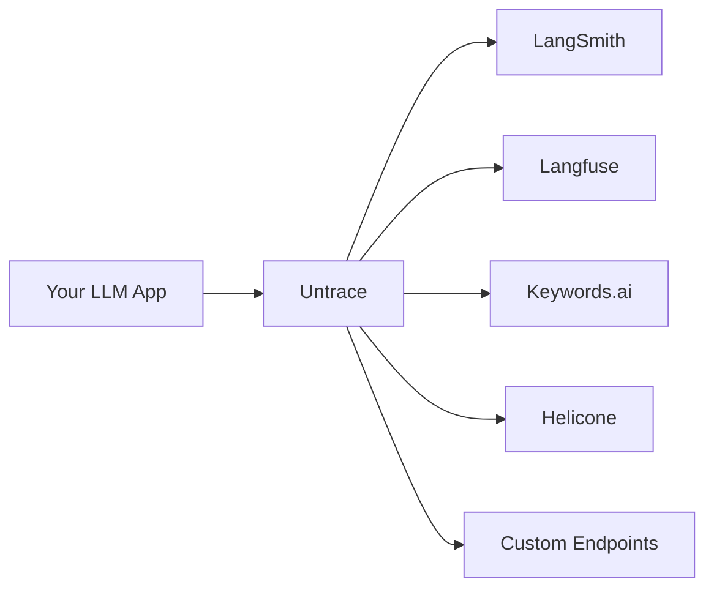

## What is Untrace?

Untrace is a middleware service that captures LLM trace events from your applications and intelligently routes them to multiple observability platforms. Think of it as Segment.io, but specifically designed for LLM traces. Integrate once, observe everywhere.

<CardGroup cols={2}>
  <Card
    title="Quick Start"
    icon="rocket"
    href="/quickstart"
  >
    Start routing LLM traces in under 5 minutes
  </Card>
  <Card
    title="Dashboard"
    icon="gauge"
    href="/dashboard"
  >
    Monitor and route traces in real-time
  </Card>
</CardGroup>

## Why Untrace?

Building LLM applications requires visibility into model performance, costs, and behavior. Untrace simplifies observability by providing a single integration point for all your LLM monitoring needs.

<CardGroup cols={2}>
  <Card
    title="Single Integration"
    icon="plug"
    href="/features/integration"
  >
    Integrate once with Untrace, send traces to any observability platform
  </Card>
  <Card
    title="Intelligent Routing"
    icon="route"
    href="/sdk"
  >
    Route traces based on model, cost, errors, or custom rules
  </Card>
  <Card
    title="No Vendor Lock-in"
    icon="unlock"
    href="/security"
  >
    Switch between observability platforms without changing your code
  </Card>
  <Card
    title="Cost Optimization"
    icon="dollar-sign"
    href="/providers"
  >
    Sample intelligently to reduce observability costs while maintaining visibility
  </Card>
</CardGroup>

## How It Works



## Getting Started

The fastest way to get started with Untrace is through our OpenAI proxy:

<CodeGroup>

```python Python
from openai import OpenAI

client = OpenAI(
    api_key="your-openai-key",
    base_url="https://api.untrace.dev/v1/proxy",
    default_headers={
        "X-Untrace-Key": "your-untrace-key"
    }
)

# Use OpenAI as normal - traces are automatically captured
response = client.chat.completions.create(
    model="gpt-4",
    messages=[{"role": "user", "content": "Hello!"}]
)
```

```typescript TypeScript
import OpenAI from 'openai';

const openai = new OpenAI({
  apiKey: 'your-openai-key',
  baseURL: 'https://api.untrace.dev/v1/proxy',
  defaultHeaders: {
    'X-Untrace-Key': 'your-untrace-key'
  }
});

// Use OpenAI as normal - traces are automatically captured
const response = await openai.chat.completions.create({
  model: 'gpt-4',
  messages: [{ role: 'user', content: 'Hello!' }]
});
```

```javascript JavaScript
const OpenAI = require('openai');

const openai = new OpenAI({
  apiKey: 'your-openai-key',
  baseURL: 'https://api.untrace.dev/v1/proxy',
  defaultHeaders: {
    'X-Untrace-Key': 'your-untrace-key'
  }
});

// Use OpenAI as normal - traces are automatically captured
const response = await openai.chat.completions.create({
  model: 'gpt-4',
  messages: [{ role: 'user', content: 'Hello!' }]
});
```

</CodeGroup>

Visit our [Quick Start](/quickstart) guide to learn more about setting up Untrace for your LLM applications.

## Supported LLM Providers

Untrace works with all major LLM providers:

- **OpenAI** (GPT-4, GPT-3.5, Embeddings)
- **Anthropic** (Claude 3, Claude 2)
- **Google** (Gemini Pro, PaLM)
- **Mistral** (Mistral Large, Medium, Small)
- **Cohere** (Command, Embed)
- **Hugging Face** (Open source models)
- **AWS Bedrock** (Multiple providers)
- **Azure OpenAI** (Enterprise deployments)
- **Together.ai**, **Replicate**, and more...

## Observability Integrations

Route your traces to any combination of platforms:

- **[LangSmith](https://smith.langchain.com)** - Full-featured LLM observability
- **[Langfuse](https://langfuse.com)** - Open source LLM engineering platform
- **[Keywords.ai](https://keywords.ai)** - LLM monitoring and analytics
- **[Helicone](https://helicone.ai)** - LLM observability and caching
- **[Arize Phoenix](https://phoenix.arize.com)** - ML observability platform
- **[LangWatch](https://langwatch.ai)** - LLM quality monitoring
- **Custom Webhooks** - Send to your own endpoints

## Key Features

### 🔀 Intelligent Routing

Route traces based on sophisticated rules:
- **Model-based**: Send GPT-4 traces to one platform, Claude to another
- **Cost-based**: Route high-cost requests for detailed analysis
- **Error-based**: Send failed requests to debugging platforms
- **Sampling**: Reduce costs with intelligent sampling strategies
- **A/B Testing**: Split traffic between platforms for comparison

### 📊 Unified Analytics

Get insights across all your observability tools:
- Aggregate metrics from multiple platforms
- Compare performance across different tools
- Unified cost tracking and optimization
- Cross-platform trace correlation

### 🔒 Privacy & Security

Built with enterprise requirements in mind:
- **PII Detection**: Automatic detection and redaction
- **End-to-end Encryption**: Secure trace transmission
- **Data Residency**: Control where your data flows
- **Compliance**: GDPR, SOC2, HIPAA ready
- **On-premise Option**: Deploy in your own infrastructure
