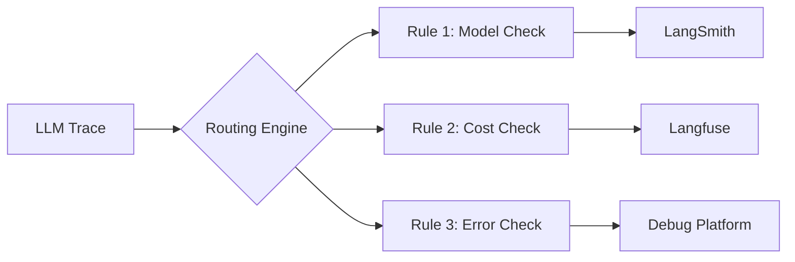

## Overview

Untrace's intelligent routing engine allows you to send LLM traces to different observability platforms based on configurable rules. Route by model, cost, errors, environment, or any custom criteria.

<CardGroup cols={2}>
  <Card
    title="Model-based Routing"
    icon="brain"
    href="#model-based-routing"
  >
    Send traces to different platforms based on the LLM model
  </Card>
  <Card
    title="Cost-based Routing"
    icon="dollar-sign"
    href="#cost-based-routing"
  >
    Route expensive requests for detailed analysis
  </Card>
  <Card
    title="Error Routing"
    icon="triangle-exclamation"
    href="#error-routing"
  >
    Send failed requests to debugging platforms
  </Card>
  <Card
    title="Sampling"
    icon="percentage"
    href="#sampling-strategies"
  >
    Reduce costs with intelligent sampling
  </Card>
</CardGroup>

## How Routing Works



1. **Trace Capture**: Untrace captures LLM traces via SDK or proxy
2. **Rule Evaluation**: Traces are evaluated against your routing rules
3. **Destination Selection**: Matching rules determine where traces go
4. **Delivery**: Traces are sent to selected platforms in parallel

## Basic Routing Rules

### Simple Model Routing

Route traces based on the LLM model:

```yaml
rules:
  - name: "GPT-4 to LangSmith"
    condition:
      model: "gpt-4"
    destination: "langsmith"
    
  - name: "Claude to Langfuse"
    condition:
      model: "claude-*"
    destination: "langfuse"
    
  - name: "Everything else"
    condition: true  # Default rule
    destination: "default-platform"
```

### Environment-based Routing

Different routing for different environments:

```yaml
rules:
  - name: "Production Monitoring"
    condition:
      environment: "production"
    destinations:
      - platform: "langsmith"
        project: "production-monitoring"
      - platform: "datadog"  # Send to multiple platforms
    
  - name: "Development Traces"
    condition:
      environment: "development"
    destination: "langfuse"  # Free tier friendly
```

## Advanced Routing

### Complex Conditions

Use boolean logic for sophisticated routing:

```yaml
rules:
  - name: "High-value Production Traces"
    condition:
      AND:
        - environment: "production"
        - OR:
          - model: "gpt-4"
          - model: "claude-3-opus"
        - cost: "> 0.10"
    destination: "premium-monitoring"
```

### Multi-destination Routing

Send traces to multiple platforms:

```yaml
rules:
  - name: "Critical Errors"
    condition:
      error: true
    destinations:
      - platform: "langsmith"
        priority: "high"
      - platform: "pagerduty"
        alert: true
      - platform: "slack"
        channel: "#llm-errors"
```

### Conditional Fields

Include/exclude fields based on destination:

```yaml
rules:
  - name: "Public Demo"
    condition:
      tags: ["demo"]
    destination: "public-langfuse"
    transform:
      redact: ["user_id", "session_id"]
      include_only: ["model", "tokens", "latency"]
```

## Sampling Strategies

### Basic Sampling

Reduce costs by sampling traces:

```yaml
rules:
  - name: "Sample GPT-3.5"
    condition:
      model: "gpt-3.5-turbo"
    destination: "langsmith"
    sampling:
      rate: 0.1  # 10% of traces
```

### Adaptive Sampling

Sample based on multiple factors:

```yaml
sampling:
  default_rate: 0.05  # 5% baseline
  
  rules:
    # Always capture errors
    - condition:
        error: true
      rate: 1.0  # 100%
    
    # Higher sampling for expensive requests
    - condition:
        cost: "> 1.00"
      rate: 0.5  # 50%
    
    # Lower sampling for high-volume endpoints
    - condition:
        endpoint: "/api/chat"
        volume: "> 1000/hour"
      rate: 0.01  # 1%
```

### Reservoir Sampling

Ensure minimum trace count:

```yaml
sampling:
  strategy: "reservoir"
  config:
    min_traces_per_hour: 100
    max_traces_per_hour: 10000
    target_cost: 50.00  # USD per day
```

## Routing by Criteria

### Cost-based Routing

Route based on token costs:

```yaml
rules:
  # High-cost analysis
  - name: "Expensive Requests"
    condition:
      cost: "> 0.50"
    destinations:
      - platform: "langsmith"
        tags: ["high-cost", "analyze"]
      - platform: "cost-analytics"
  
  # Budget-friendly routing
  - name: "Low-cost Requests"
    condition:
      cost: "< 0.01"
    destination: "basic-monitoring"
    sampling:
      rate: 0.01  # 1% sampling for cheap requests
```

### Latency-based Routing

Route slow requests for performance analysis:

```yaml
rules:
  - name: "Slow Requests"
    condition:
      latency_ms: "> 5000"
    destination: "performance-platform"
    metadata:
      alert: "high-latency"
      priority: "p2"
```

### Error Routing

Sophisticated error handling:

```yaml
rules:
  # Rate limit errors
  - name: "Rate Limits"
    condition:
      error:
        code: 429
    destinations:
      - platform: "monitoring"
        alert: "rate-limit-hit"
      - platform: "autoscaler"
        action: "scale-up"
  
  # Timeout errors
  - name: "Timeouts"
    condition:
      error:
        type: "timeout"
    destination: "performance-debugging"
  
  # All other errors
  - name: "General Errors"
    condition:
      error: true
    destination: "error-tracking"
```

## Dynamic Routing

### Tag-based Routing

Route based on custom tags:

```typescript
// In your code
const response = await openai.chat.completions.create({
  model: "gpt-4",
  messages: messages,
  // Custom tags for routing
  metadata: {
    customer_tier: "enterprise",
    feature: "advanced-analysis",
    team: "ml-research"
  }
});
```

```yaml
# Routing rules
rules:
  - name: "Enterprise Customers"
    condition:
      tags:
        customer_tier: "enterprise"
    destination: "premium-monitoring"
    
  - name: "ML Research Team"
    condition:
      tags:
        team: "ml-research"
    destination: "research-platform"
```

### A/B Testing

Route traces for platform comparison:

```yaml
rules:
  - name: "A/B Test Platforms"
    condition:
      model: "gpt-4"
    destinations:
      - platform: "langsmith"
        sampling:
          rate: 0.5
          group: "A"
      - platform: "langfuse"
        sampling:
          rate: 0.5
          group: "B"
```

## Rule Priority

Rules are evaluated in order. First match wins:

```yaml
rules:
  # Priority 1: Critical errors (always capture)
  - name: "Critical Errors"
    condition:
      AND:
        - error: true
        - tags.severity: "critical"
    destination: "emergency-monitoring"
    
  # Priority 2: High-value customers
  - name: "VIP Customers"
    condition:
      tags.customer_tier: "vip"
    destination: "premium-monitoring"
    
  # Priority 3: General errors
  - name: "All Errors"
    condition:
      error: true
    destination: "error-tracking"
    
  # Priority 4: Default
  - name: "Default"
    condition: true
    destination: "general-monitoring"
```

## Configuration Examples

### Complete Configuration

```yaml
# untrace.routing.yaml
version: "1.0"

defaults:
  sampling_rate: 0.1
  timeout_ms: 5000
  retry_attempts: 3

destinations:
  langsmith:
    platform: "langsmith"
    api_key: "${LANGSMITH_API_KEY}"
    project: "main"
    
  langfuse:
    platform: "langfuse"
    public_key: "${LANGFUSE_PUBLIC_KEY}"
    secret_key: "${LANGFUSE_SECRET_KEY}"
    
  debug_webhook:
    platform: "webhook"
    url: "https://debug.company.com/traces"
    headers:
      Authorization: "Bearer ${DEBUG_TOKEN}"

rules:
  # Production rules
  - name: "Production GPT-4"
    condition:
      AND:
        - environment: "production"
        - model: "gpt-4*"
    destinations: ["langsmith"]
    sampling:
      rate: 0.5
      
  # Development rules
  - name: "Dev Environment"
    condition:
      environment: "development"
    destinations: ["langfuse"]
    
  # Error handling
  - name: "All Errors"
    condition:
      error: true
    destinations: ["langsmith", "debug_webhook"]
    
  # Default rule
  - name: "Catch All"
    condition: true
    destinations: ["langfuse"]
    sampling:
      rate: 0.05
```

### Programmatic Configuration

Configure routing via SDK:

```typescript
import { init } from '@untrace/sdk';

const untrace = init({
  apiKey: 'your-api-key',
  routing: {
    rules: [
      {
        name: 'High Cost Analysis',
        condition: (trace) => trace.cost > 0.10,
        destination: 'langsmith',
        transform: (trace) => ({
          ...trace,
          metadata: {
            ...trace.metadata,
            highCost: true
          }
        })
      }
    ]
  }
});
```

## Best Practices

### 1. Start Simple
Begin with basic routing and add complexity as needed:
```yaml
# Start with this
rules:
  - condition: { model: "gpt-4" }
    destination: "platform-a"
  - condition: true
    destination: "platform-b"
```

### 2. Use Sampling Wisely
Balance cost and visibility:
- 100% for errors and critical paths
- 10-50% for expensive models
- 1-5% for high-volume, low-cost requests

### 3. Monitor Rule Performance
Track routing metrics:
```yaml
rules:
  - name: "My Rule"
    condition: { model: "gpt-4" }
    destination: "platform"
    metrics:
      enabled: true
      report_to: "monitoring-dashboard"
```

### 4. Test Before Production
Use test tags to verify routing:
```typescript
// Test your routing
const response = await client.chat.completions.create({
  model: "gpt-4",
  messages: messages,
  metadata: {
    test: true,
    expected_destination: "langsmith"
  }
});
```

## Troubleshooting

### Rules Not Matching

Enable debug mode to see rule evaluation:

```typescript
init({
  apiKey: 'your-api-key',
  debug: true,
  routing: {
    debug: true,  // Shows rule evaluation
    rules: [...]
  }
});
```

### Delivery Failures

Check delivery status in the dashboard:
- Go to [Dashboard → Routing](https://app.untrace.dev/routing)
- View delivery success rates
- Check error logs for failed deliveries

### Performance Impact

Routing adds minimal overhead:
- Rule evaluation: < 1ms
- Parallel delivery to multiple platforms
- Async processing doesn't block your app

## Next Steps

<CardGroup>
  <Card
    title="Dashboard Configuration"
    icon="gauge"
    href="/dashboard#routing-configuration"
  >
    Configure routing in the web interface
  </Card>
  <Card
    title="SDK Reference"
    icon="code"
    href="/sdk#routing"
  >
    Programmatic routing configuration
  </Card>
  <Card
    title="API Reference"
    icon="book"
    href="/api-reference/endpoint/routing-rules"
  >
    Routing API documentation
  </Card>
  <Card
    title="Examples"
    icon="flask"
    href="https://github.com/untrace-dev/examples/routing"
  >
    Real-world routing examples
  </Card>
</CardGroup>